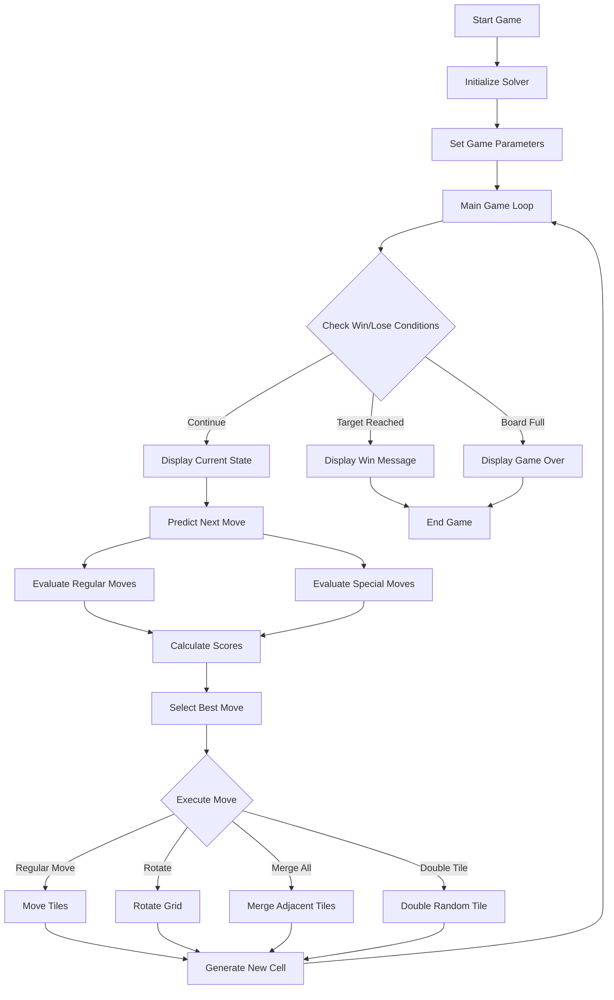

# AI Solver for 2048 (8 x 8)

## Submitted By
- Khair Muhammad (22K – 4290)
- Salman Haider (22K – 4574)
- Hazeen Dodhiya (22K – 4357)
- **Demo Video:** [Watch here](https://drive.google.com/file/d/1nDo7iW_QvkxayixNbH9f-kBfDrjFa-m0/view)

### Course
Artificial Intelligence (AI – 2002)  
**Instructors:** Ms. Fizza Aqeel, Sir Abdullah Yaqoob  
**Submission Date:** 10 May 2025  

---

## 1. Executive Summary
This project involves developing an AI solver for the game 2048 using Expectimax and heuristic-based strategies. The goal is to enable an AI to autonomously play and optimize performance in the game by making intelligent decisions. Innovations include heuristic evaluations, Expectimax-based future state predictions, strategic tile placement techniques, and custom special moves.

---

## 2. Introduction

### Background
2048 is a single-player sliding tile puzzle played on a grid. Players combine like-numbered tiles by sliding them in four directions. The aim is to reach the 2048 tile. This project introduces an AI-driven approach using Expectimax and heuristic scoring to achieve higher scores on an **8×8 grid**.

### Objectives
- Implement AI to play 2048.
- Explore Expectimax and Minimax algorithms.
- Design custom heuristics for optimal gameplay.
- Evaluate performance and refine AI strategy.

---

## 3. Game Description

### Original Rules
2048 is played by merging identical numbered tiles on a 4x4 grid. New tiles (2 or 4) spawn randomly after each move. The goal is to reach a tile with value 2048.

### Innovations and Modifications
- AI-controlled gameplay using Expectimax.
- Heuristic-based evaluations (e.g., tile merging, empty tiles).
- Strategic tile organization (e.g., snake pattern).
- Emphasis on avoiding dead-ends and maximizing score.
- **Special Moves**:
  - `rotate`: Rotate the grid to reposition tiles (3 uses).
  - `merge_all`: Merge all eligible tiles at once (2 uses).
  - `double_tile`: Double the value of a random tile (2 uses).

---

## 4. AI Approach and Methodology

### Operational Logic
- **Initialization**: The solver uses NumPy arrays and a custom Grid class to create an 8x8 game state.
- **Move Prediction**: `next_move_predictor()` tests all directions and scores each resulting grid.
- **Heuristic Scoring**:
  - **Snake Pattern**: Encourages placing large tiles in a continuous flow.
  - **Adjacent Tile Scoring**: Prioritizes grouping similar tiles.
  - **Empty Tile Count**: More open tiles indicate more options and better survivability.
  - **Tile Smoothing**: Penalizes sharp differences between neighboring tile values.

### Expectimax Algorithm
Simulates future board states probabilistically to handle randomness of new tile spawns. Prioritizes actions with the highest expected reward based on heuristic evaluations.

---

## 5. Game Mechanics and Rules

### Modified Game Rules
AI plays automatically using scoring functions. Special moves are available and strategically limited in use.

### Turn-based Mechanics
1. AI evaluates the board state.
2. Considers regular and special moves.
3. Scores all outcomes.
4. Selects the best move.
5. Executes the move and inserts a new tile.
6. Repeats until game ends.

### Winning Conditions
Reach tile 2048 or maximize score before the board fills.

---

## 6. Project Flow

---

## 7. Implementation and Development

### Development Process
The game logic and AI were implemented in Python. Core modules include:
- `game.py`: Manages tile movement and merging.
- `grid.py`: Represents the game board.
- `dqn.py`: (optional) Placeholder for reinforcement learning.

### Tools & Languages
- **Language:** Python
- **Libraries:** NumPy, Random, Tensorflow
- **Tools:** GitHub, Jupyter Notebook, Pygame (optional)

### Challenges
- Managing performance for deep Expectimax trees.
- Balancing heuristics to avoid repetitive loops.
- Ensuring correct game logic for tile merging.

---

## 8. Results and Discussion

The AI solver was able to achieve consistent performance in 2048, often reaching tiles of 1024 and above. The Expectimax approach showed high effectiveness, especially when paired with robust heuristics.

---

## 9. References

- https://www.quora.com/How-do-you-build-AI-for-solving-this-game-2048-game
